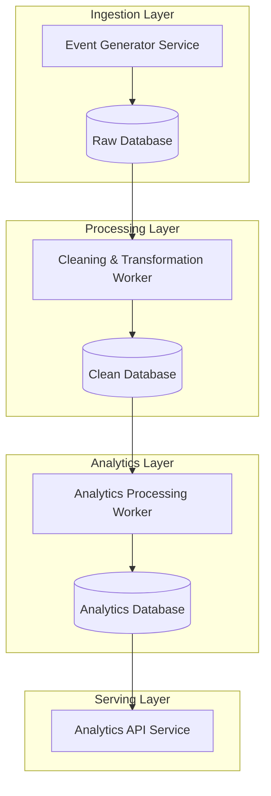
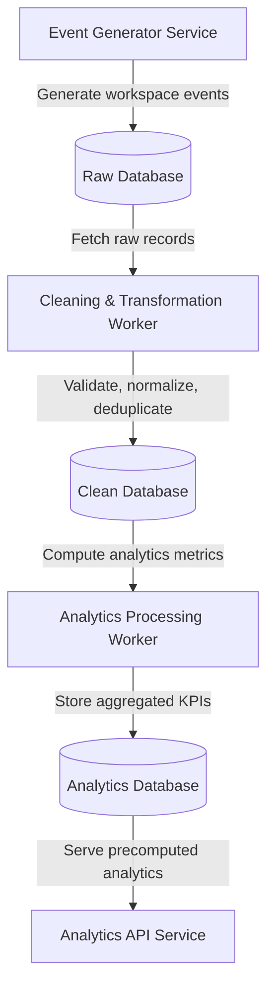
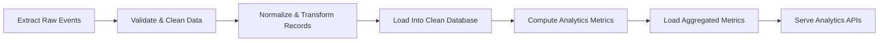

# TaskPulse Data Platform

A Dockerized multi-stage analytics platform that simulates real-time workspace activity, processes raw event streams through ETL pipelines, computes analytics metrics, and serves precomputed analytics APIs.

The platform is designed to model real-world data engineering workflows using continuous event generation, layered databases, Python-based transformation workers, and analytics processing pipelines.

---

## Current Development Status

### Completed
- Multi-database architecture design
- Raw, Clean, and Analytics database schemas
- Dockerized project structure
- Event data model design
- Service architecture planning

### In Progress
- Event Generator Service
- Cleaning & Transformation Worker
- Analytics Processing Worker

### Planned
- Metrics computation pipelines
- Analytics APIs
- Monitoring and observability

---

# Tech Stack

| Layer               | Technology     |
| ------------------- | -------------- |
| Event Generation    | Node.js        |
| API Layer           | Express        |
| Data Processing     | Python         |
| Data Transformation | pandas         |
| Databases           | PostgreSQL     |
| Containerization    | Docker         |
| Orchestration       | Docker Compose |

---

# 1. Architecture Diagram

The platform follows a multi-stage analytics pipeline architecture:

1. Event Generator continuously produces simulated workspace events.
2. Raw events are stored in the Raw Database.
3. Cleaning Workers validate, normalize, and transform raw data.
4. Cleaned operational data is stored in the Clean Database.
5. Analytics Workers compute aggregated metrics and KPIs.
6. Precomputed analytics are stored in the Analytics Database.
7. The Analytics API serves fast read-optimized endpoints.



---

# 2. Data Flow



---

# 3. Services Overview

| Service                          | Responsibility                                                   | Tech Stack      |
| -------------------------------- | ---------------------------------------------------------------- | --------------- |
| Event Generator Service          | Continuously generates simulated workspace and task events       | Node.js         |
| Cleaning & Transformation Worker | Validates, cleans, normalizes, and transforms raw event data     | Python + pandas |
| Analytics Processing Worker      | Computes analytics metrics and aggregated KPIs from cleaned data | Python + pandas |
| Analytics API Service            | Serves analytics endpoints using precomputed metrics             | Express         |
| Raw Database                     | Stores unprocessed incoming event data                           | PostgreSQL      |
| Clean Database                   | Stores validated and normalized operational datasets             | PostgreSQL      |
| Analytics Database               | Stores aggregated metrics and analytics-ready tables             | PostgreSQL      |
| Docker Infrastructure            | Containerized local development and service orchestration        | Docker          |

---

# 4. ETL Pipeline Flow

## Overview

The platform follows a multi-stage ETL (Extract, Transform, Load) pipeline architecture to process continuously generated workspace events into analytics-ready datasets.



## Extract

The Event Generator Service continuously produces simulated workspace events.

### Example Events

* task_created
* task_completed
* task_updated
* task_reassigned
* workspace_created
* user_joined_workspace

## Transform

The Cleaning Worker processes raw records by:

* validating records
* removing duplicates
* normalizing statuses
* standardizing timestamps
* cleaning malformed data
* transforming schemas

## Load

The transformed data is loaded into the clean database.

Analytics Workers then compute aggregated metrics and store them in analytics-ready tables.

---

# 5. Database Design

The platform uses a layered database architecture inspired by modern data engineering systems.

## Raw Database

Purpose:

* store unprocessed incoming events
* preserve source-of-truth raw data
* enable replay and debugging

Characteristics:

* may contain duplicates
* inconsistent formats
* incomplete records
* dirty timestamps

### Example Tables

```sql
raw_events
raw_tasks
raw_workspace_events
```

---

## Clean Database

Purpose:

* store validated operational datasets
* provide reliable normalized records
* support transformation pipelines

Characteristics:

* cleaned records
* normalized fields
* standardized timestamps
* deduplicated datasets

### Example Tables

```sql
users
tasks
workspaces
task_assignees
workspace_members
```

---

## Analytics Database

Purpose:

* store aggregated KPIs
* support dashboards and reporting
* provide fast analytics queries

Characteristics:

* read-optimized tables
* precomputed metrics
* analytics-ready datasets

### Example Tables

```sql
user_productivity_metrics
workspace_efficiency_metrics
pipeline_runs
```

---

# 6. Analytics Metrics

The platform computes analytics metrics from cleaned operational datasets.

## User Productivity Metrics

Measures:

* total assigned tasks
* completed tasks
* pending tasks
* completion rate

### Example Formula

```text
Completion Rate = (Completed Tasks / Total Tasks) * 100
```

---

## Workspace Efficiency Metrics

Measures:

* total workspace tasks
* completion percentage
* active users
* overdue tasks

---

## Pipeline Monitoring Metrics

Measures:

* rows processed
* pipeline duration
* pipeline success/failure
* processing timestamps

---

# 7. Local Setup

## Prerequisites

Install:

* Docker
* Docker Compose
* Node.js
* Python 3

---

## Clone Repository

```bash
git clone https://github.com/your-username/taskpulse-data-platform.git
```

```bash
cd taskpulse-data-platform
```

---

## Environment Variables

Create:

```bash
.env
```

Example:

```env
POSTGRES_USER=postgres
POSTGRES_PASSWORD=postgres
POSTGRES_DB=taskpulse
```

---

## Install Dependencies

### Node.js Services

```bash
npm install
```

### Python Workers

```bash
pip install -r requirements.txt
```

---

# 8. Docker Setup

## Start Containers

```bash
docker compose up --build
```

---

## Containers

The platform includes:

```text
postgres_raw
postgres_clean
postgres_analytics

generator_service
cleaning_worker
analytics_worker
analytics_api
```

---

## Stop Containers

```bash
docker compose down
```

---

## Run In Background

```bash
docker compose up -d
```

---

# Project Structure

```text
taskpulse-data-platform/
│
├── services/
│   ├── generator-service/
│   ├── analytics-api/
│
├── workers/
│   ├── cleaning-worker/
│   ├── analytics-worker/
│
├── databases/
│   ├── raw/
│   ├── clean/
│   ├── analytics/
│
├── shared/
│   ├── schemas/
│   ├── utils/
│   ├── constants/
│
├── sql/
├── docs/
├── docker/
│
├── docker-compose.yml
├── requirements.txt
├── package.json
└── README.md
```

---

# Example API Endpoints

## User Productivity

```http
GET /metrics/user-productivity
```

---

## Workspace Efficiency

```http
GET /metrics/workspace-efficiency
```

---

## Top Performers

```http
GET /metrics/top-performers
```

---

# Example Event Payload

```json
{
  "event_type": "task_completed",
  "user_id": 12,
  "workspace_id": 5,
  "task_id": 201,
  "timestamp": "2026-05-13T10:30:00Z"
}
```

---

# Engineering Concepts Demonstrated

This project demonstrates:

* ETL Pipelines
* Data Cleaning
* Analytics Engineering
* Event-Driven Architecture
* Layered Database Design
* Worker-Based Processing
* Data Normalization
* Aggregated Metrics Computation
* Precomputed Analytics APIs
* Dockerized Development Environment
* Modular Monorepo Architecture

---

# 9. Future Improvements

Planned future enhancements:

* Apache Airflow integration
* Redis queues
* Kafka event streaming
* Real-time analytics dashboards
* Data warehouse integration
* Monitoring and observability
* Pipeline retry mechanisms
* CI/CD pipelines
* Kubernetes deployment
* Streaming ETL architecture
* WebSocket live metrics
* Grafana dashboards

---

# Inspiration

The architecture is inspired by real-world analytics and data engineering systems used in modern event-driven platforms.

The project focuses on learning practical data engineering concepts through a simplified but production-inspired analy
